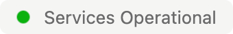
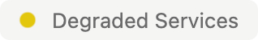
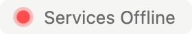

# Better Stack Status Page Badge

Add a customizable, stylish Status Badge to your website or application that links directly to your Better Stack status page. This lightweight widget displays your current service status in real time - **Operational**, **Degraded**, or **Down** - with color-coded indicators and optional auto-refresh.

Better Stack already offers a badge however, it uses an `iframe` and is not customizable. This script replaces that feature.

Perfect for SaaS dashboards, support portals, admin panels, documentation sites, and anywhere users need at-a-glance service health.

## 🚀 Features

- 🎨 **Customizable Badge** - Text, icon, and styling options. Your own CSS can override everything.
- 🔁 **Auto Refresh** - Update the status every X seconds (default: 30)
- ⚡ **No Dependencies** - Pure JavaScript + optional PHP proxy.
- 🔗 **Direct Link** - Clicking the badge opens your public status page
- 🟢 **Instant Loading** - Shows a *Loading* state before the first fetch
- 🛡️ **Graceful Failover** - Displays *Connection Error* if the proxy/Worker fails
- 🌐 **CORS Safe** - Works even when Better Stack blocks browser requests

## 🎯 Examples & Demo

Want to see the badge working live?

You can view an active demo in the footer of our website:

🔗 **https://unicornpanel.net/**

The badge updates automatically based on the current Better Stack status and demonstrates how it will look once integrated into your own project.

### 🖼️ Example Outputs

| State | Preview |
|-------|---------|
| **Operational** |  |
| **Degraded** |  |
| **Down** |  |
| **Loading** |  |

> Customize the badge by changing the `data-*` attributes on the script tag-no additional setup required.

## 📦 Installation (Local)

Clone or download this repository:

```bash
git clone https://github.com/UnicornPanel/Better-Stack-Status-Page-Badge.git
```

1) Change the location of the proxy (`STATUS_URL`) in `badge.js`
2) Pick a proxy from the `proxies` folder. You can choose between a PHP script, Bunny edge Script, or a Cloudflare Worker
2) Include the script on your site:
3) Change the attribute `data-page` to your own Status Page URL i.e. myname.betterstack.com or status.domain.com

```html
<div class="status"></div>

<script src="/path/to/badge.js"
    data-page="status.betterstack.com"
    data-target=".status"
    defer></script>
```

## 📦 Installation (CDN)

1) Include the script on your site:
2) Change the attribute `data-page` to your own Status Page URL i.e. myname.betterstack.com or status.domain.com

```html
<div class="status"></div>

<script src="https://cdn.jsdelivr.net/gh/unicornpanel/better-stack-status-page-badge@main/cdn-badge.js"
    data-page="status.betterstack.com"
    data-target=".status"
    defer></script>
```

## 📦 Installation (CDN, with configurable options)

1) Include the script on your site:
2) Change the attribute `data-page` to your own Status Page URL i.e. myname.betterstack.com or status.domain.com

```html
<div class="status"></div>

<script src="https://cdn.jsdelivr.net/gh/unicornpanel/better-stack-status-page-badge@main/cdn-badge.js"
    data-page="status.betterstack.com"
    data-target=".status"
    data-refresh="60"
    data-icon="true"
    data-operational="System Operational"
    data-degraded="System Degraded"
    data-down="System Offline"
    data-load="Loading Status"
    data-error="Error Fetching Status"
    defer></script>
```

**Note:** The CDN option uses jsDelivr for the CDN and Bunny Edge Scripting for the proxy. Please use your own proxy as there's no guarantee the Bunny Edge Script will stay online.

---

## 🛠️ Configuration Options

| Attribute          | Required | Default                | Description |
|-------------------|:--------:|------------------------|-------------|
| `data-page`       | ✅ | - | Your Better Stack status domain |
| `data-target`     | ✅ | - | Selector where the badge will be rendered |
| `data-refresh`    | ❌ | `30` | Refresh interval in seconds |
| `data-icon`       | ❌ | `true` | Show the status icon |
| `data-operational`| ❌ | `Services Operational` | Text for Operational state |
| `data-degraded`   | ❌ | `Degraded Services` | Text for Degraded state |
| `data-down`       | ❌ | `Services Offline` | Text for Down state |
| `data-loading`    | ❌ | `Loading` | Message shown before first fetch |
| `data-error`      | ❌ | `Connection Error` | Message shown when proxy/Worker fails |

---

## 🔁 PHP Proxy (Optional)

Better Stack blocks browser CORS requests. If you don’t want to use a Cloudflare Worker or Bunny CDN, use the included PHP proxy to safely fetch status:

```php
proxy.php?page=status.betterstack.com
```

### Supported Flags for Proxies

| Query Param | Default | Description |
|-------------|---------|-------------|
| `state-only` | `1` | Returns only `aggregate_state` instead of the full JSON supplied by Better Stack |

### Cache Layer

The proxy caches responses for **30 seconds** to avoid unnecessary requests and improve resiliency.

---

## 🖼️ Example Badge Output

```html
<a href="https://status.betterstack.com" target="_blank" class="bs-badge">
    <span class="bs-badge-operational"></span> Services Operational
</a>
```

The icon color and text automatically update based on the current Better Stack status page.

---

## 🧠 How It Works

1. The badge renders instantly in a **Loading** state
2. JavaScript requests the current `aggregate_state` via your proxy or Worker
3. The badge updates based on the returned value  
   - 🟢 Operational  
   - 🟡 Degraded  
   - 🔴 Down  
4. The badge refreshes at the interval you choose (`data-refresh`)

---

## 📝 License

This project is licensed under the **MIT License**.  
See the [`LICENSE`](LICENSE) file for details.

---

## 🤝 Contributing

Pull requests are welcome!  
Have an idea for improvements-like multi-monitor support, dark mode, or emoji icons? Open an issue or submit a PR.

---

## ⭐ Support

If you find this useful, please ⭐ the repository -
it helps others discover it and improves the visibility of the project.